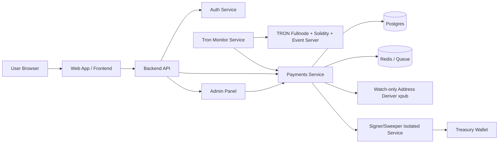

# TRON USDT (TRC20) Self-Hosted Membership Payments

## Assumptions
- Single-tenant application backend for now (multi-tenant can be added via `tenant_id`).
- TRON USDT TRC20 contract used: `TXLAQ63Xg1NAzckPwKHvzw7CSEmLMEqcdj`.
- Finality policy: **20 confirmations** before marking paid.
- Invoice strategy: **per-invoice address** (not per-user) to simplify reconciliation and reduce attribution ambiguity.
- Dev mode may use public TRON API endpoint for faster bootstrap; prod mode targets self-hosted TRON infra.

---

## Architecture Diagram (Text)

---

## Folder Structure

- `server/src/payments/config.ts` - chain/token/finality/constants
- `server/src/payments/types.ts` - normalized payment/auth domain types
- `server/src/payments/storage.ts` - in-memory store (replace with Postgres repo)
- `server/src/payments/addressDeriver.ts` - watch-only invoice address derivation facade
- `server/src/payments/authService.ts` - email/password + TOTP 2FA + reset
- `server/src/payments/tronClient.ts` - TRON transfer fetch client
- `server/src/payments/paymentService.ts` - plans, invoices, payment verification, subscription activation
- `server/src/payments/monitorService.ts` - background chain monitor loop
- `server/src/routes/auth.ts` - auth endpoints
- `server/src/routes/payments.ts` - plans/invoices/subscriptions/admin payment endpoints
- `server/migrations/001_payments_schema.sql` - PostgreSQL schema
- `src/pages/PricingPage.tsx` - live plans + invoice creation
- `src/pages/PaymentCheckoutPage.tsx` - payment screen (amount/address/QR/status polling)
- `src/pages/LoginPage.tsx`, `src/pages/SignupPage.tsx` - auth pages
- `src/pages/AdminPaymentsPage.tsx` - admin plan CRUD

---

## Database Schema
See: `server/migrations/001_payments_schema.sql`

Tables:
- `app_users`, `app_sessions`
- `plans`
- `invoices`
- `payment_events`
- `subscriptions`
- `audit_events`

---

## Implemented Flows

### 1) Plan CRUD (Admin)
- `GET /api/admin/plans`
- `POST /api/admin/plans`
- `DELETE /api/admin/plans/:id`

### 2) Invoice Creation
- `POST /api/payments/invoices` (auth required)
- Creates per-invoice TRON deposit address via watch-only deriver.

### 3) Payment Page
- `GET /api/payments/invoices/:invoiceId`
- Frontend checkout page polls status.

### 4) TRON Monitor + Verification
- Monitor scans awaiting/partial invoices and fetches TRC20 transfers for invoice address.
- Verifies:
  - contract address == configured TRON USDT contract
  - recipient address == invoice deposit address
  - tx success
  - confirmations >= threshold
  - idempotency per tx/log/invoice key

### 5) Subscription Activation
- On paid invoice, creates `subscriptions` row with plan snapshot and payment tx hash.

### 6) Auth + 2FA + Reset
- Signup/login endpoints
- TOTP setup + enable
- Password reset request + confirm

### 7) Admin Overrides
- Mark invoice paid (auditable flow)
- Extend subscription duration

---

## Setup Guide

### Local Dev
1. Install deps:
   - `npm install`
2. Start backend:
   - `npm run server:dev`
3. Start frontend:
   - `npm run dev`
4. Login with dev admin:
   - email: `admin@bitrium.local`
   - password: `Admin12345!`

### Docker Compose (local self-hosted stack skeleton)
- `docker compose -f docker-compose.payments.yml up`

### Production Notes
- Replace in-memory storage with Postgres repository + migrations execution.
- Run monitor as separate service/process.
- Run signer/sweeper in isolated network namespace/container with minimum privileges.
- Use dedicated key management:
  - encrypted key blobs at rest
  - master secret from KMS/HSM or secrets manager
- Point TRON endpoints to self-hosted:
  - full node
  - solidity node
  - event server

---

## Security Checklist

- [x] Per-invoice address model
- [x] Private secrets encrypted at rest (AES-GCM utility)
- [x] No secret logging
- [x] Email/password hashing using PBKDF2
- [x] 2FA TOTP support
- [x] Rate limiting on auth endpoints
- [x] Invoice expiry and status transitions
- [x] Confirmation threshold policy
- [x] Token contract verification
- [x] Recipient address verification
- [x] Idempotent payment event processing
- [x] Admin-only plan management and overrides
- [x] Audit trail hooks via existing audit service

---

## Threat Model (Key Risks + Mitigations)

1. **Hot wallet compromise**
- Mitigation: watch-only xpub in API, isolated signer/sweeper service, encrypted key material.

2. **False payment acceptance / replay**
- Mitigation: strict contract + recipient + confirmation checks; idempotency keys on events.

3. **Underpay abuse**
- Mitigation: underpay => `partially_paid` only; no activation until required amount met.

4. **Double-processing race**
- Mitigation: event key dedupe and atomic state transitions (DB transaction in production).

5. **Bruteforce auth**
- Mitigation: endpoint rate limiting + PBKDF2 + optional mandatory 2FA.

6. **Admin override abuse**
- Mitigation: RBAC + mandatory audit records + reason fields.

---

## Extensibility
- Add chain by implementing new monitor/client + token constants and extending `chain/token` enums.
- Keep invoice model generic (`chain`, `token`, confirmations policy per chain).
